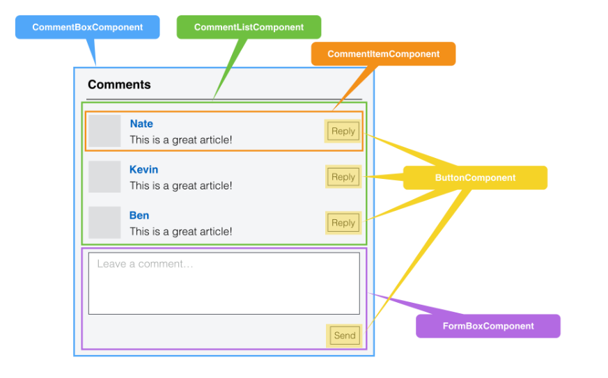

### React
#### 1，ReactJS简介
[React](https://github.com/facebook/react) 起源于 Facebook 的内部项目，因为该公司对市场上所有 JavaScript MVC 框架，都不满意，就决定自己写一套，用来架设 [Instagram](https://www.instagram.com/?hl=en) 的网站。做出来以后，发现这套东西很好用，就在2013年5月开源了。由于 React 的设计思想极其独特，属于革命性创新，性能出众，代码逻辑却非常简单。所以，越来越多的人开始关注和使用，认为它可能是将来 Web 开发的主流工具。

#### 2，ReactJS的背景和原理
在Web开发中，我们总需要将变化的数据实时反应到UI上，这时就需要对DOM进行操作。而复杂或频繁的DOM操作通常是性能瓶颈产生的原因（如何进行高性能的复杂DOM操作通常是衡量一个前端开发人员技能的重要指标）。
React为此引入了虚拟DOM（Virtual DOM）的机制：在浏览器端用Javascript实现了一套DOM API。基于React进行开发时所有的DOM构造都是通过虚拟DOM进行，每当数据变化时，React都会重新构建整个DOM树，然后React将当前整个DOM树和上一次的DOM树进行对比，得到DOM结构的区别，然后仅仅将需要变化的部分进行实际的浏览器DOM更新。而且React能够批处理虚拟DOM的刷新，在一个事件循环（Event Loop）内的两次数据变化会被合并，例如你连续的先将节点内容从A变成B，然后又从B变成A，React会认为UI不发生任何变化，而如果通过手动控制，这种逻辑通常是极其复杂的。尽管每一次都需要构造完整的虚拟DOM树，但是因为虚拟DOM是内存数据，性能是极高的，而对实际DOM进行操作的仅仅是Diff部分，因而能达到提高性能的目的。这样，在保证性能的同时，开发者将不再需要关注某个数据的变化如何更新到一个或多个具体的DOM元素，而只需要关心在任意一个数据状态下，整个界面是如何Render的。
如果你像在90年代那样写过服务器端Render的纯Web页面那么应该知道，服务器端所要做的就是根据数据Render出HTML送到浏览器端。如果这时因为用户的一个点击需要改变某个状态文字，那么也是通过刷新整个页面来完成的。服务器端并不需要知道是哪一小段HTML发生了变化，而只需要根据数据刷新整个页面。换句话说，任何UI的变化都是通过整体刷新来完成的。而React将这种开发模式以高性能的方式带到了前端，每做一点界面的更新，你都可以认为刷新了整个页面。至于如何进行局部更新以保证性能，则是React框架要完成的事情。
借用Facebook介绍React的视频中聊天应用的例子，当一条新的消息过来时，你的开发过程需要知道哪条数据过来了，如何将新的DOM结点添加到当前DOM树上；而基于React的开发思路，你永远只需要关心数据整体，两次数据之间的UI如何变化，则完全交给框架去做。可以看到，使用React大大降低了逻辑复杂性，意味着开发难度降低，可能产生Bug的机会也更少。

#### 3，组件化
虚拟DOM(virtual-dom)不仅带来了简单的UI开发逻辑，同时也带来了组件化开发的思想，所谓组件，即封装起来的具有独立功能的UI部件。React推荐以组件的方式去重新思考UI构成，将UI上每一个功能相对独立的模块定义成组件，然后将小的组件通过组合或者嵌套的方式构成大的组件，最终完成整体UI的构建。例如，Facebook的instagram.com整站都采用了React来开发，整个页面就是一个大的组件，其中包含了嵌套的大量其它组件。
如果说MVC的思想让你做到视图-数据-控制器的分离，那么组件化的思考方式则是带来了UI功能模块之间的分离。我们通过一个典型的Blog评论界面来看MVC和组件化开发思路的区别。
对于MVC开发模式来说，开发者将三者定义成不同的类，实现了表现，数据，控制的分离。开发者更多的是从技术的角度来对UI进行拆分，实现松耦合。
对于React而言，则完全是一个新的思路，开发者从功能的角度出发，将UI分成不同的组件，每个组件都独立封装。
在React中，你按照界面模块自然划分的方式来组织和编写你的代码，对于评论界面而言，整个UI是一个通过小组件构成的大组件，每个组件只关心自己部分的逻辑，彼此独立。

React认为一个组件应该具有如下特征： 
（1）可组合（Composeable）：一个组件易于和其它组件一起使用，或者嵌套在另一个组件内部。如果一个组件内部创建了另一个组件，那么说父组件拥有（own）它创建的子组件，通过这个特性，一个复杂的UI可以拆分成多个简单的UI组件。 
（2）可重用（Reusable）：每个组件都是具有独立功能的，它可以被使用在多个UI场景。 
（3）可维护（Maintainable）：每个小的组件仅仅包含自身的逻辑，更容易被理解和维护。
